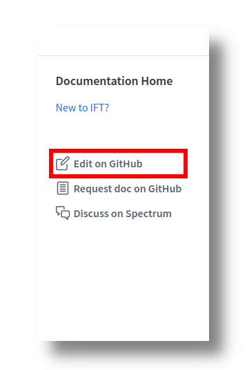

We are thrilled to receive your contribution! There are `2` ways to get started: 

+ `A` is simple and is recommended for most documentation edit. 
+ `B` is more technical, requires local tool setup, and is recommended for web developer working on custom component or core maintainer adding new section for the document.

> **Note:** we use [markdown](https://www.markdownguide.org/basic-syntax/) to format our document. If you are not familiar with its syntax, feel free to consult [this cheat sheet](https://www.markdownguide.org/cheat-sheet/)

## A. Use the built-in github edit link

You can use GitHub's built-in text editor feature to edit any documentation. Simply click on the link that says `Edit on Github` on any documentation page, and you will be taken to its respective github editor. This link is positioned on the right sidebar for desktop, and at the bottom footer for mobile:



Once you have finished editing, simply click `Propose file change`. This will take you to a page where you can see the changes you have made. Click `Create pull request` to open a textbox where you will be asked to describe your change. This `pull request` is discussed in detail [here](/contributions/how-to-submit-work-for-review/). If your change is related to a documentation request, please put the request number in the `Issue resolved` section. If you believe your edit will "completely" solve the request, please put `closes` next to the request number. Else, put only the request number. Example for the first case is as follow:


## B. Build the documentation locally

This documentation was built using [Gatsby](https://www.gatsbyjs.org/). The core tools required to build it are:
+ [git](https://git-scm.com/)
+ [nodejs](http://nodejs.org/) 

Please consult the links above in order to install the prerequisites. Prior to cloning (equivalent to downloading) the repository to your machine, it will be helpful to fork the repository:


This creates a copy of the documentation on github under your username where you can make branches to work on your new feature or edits. Then, once you have `git` setup, you can clone the repository with the following command:

```bash
# with https
git clone https://github.com/<YOUR_GITHUB_USERNAME>/doc.ift.org.git
```
OR

```bash
# with ssh
git clone git@github.com:<YOUR_GITHUB_USERNAME>/doc.ift.org.git
```

> Alternatively, you can use [Github for Desktop](https://desktop.github.com/) to clone on Windows or MacOSX.

Once cloned, `cd` inside `doc.ift.org` and run `npm i` to install the dependency:

```bash
cd doc.ift.org
npm i
```

Then, simply run `npm run dev` to start the documentation server on `localhost:8000`:

```bash
npm run start
```

You should now have the full documentation running locally. Please follow [`gitflow`](https://www.atlassian.com/git/tutorials/comparing-workflows/gitflow-workflow) guideline when it comes to making contribution. Happy coding!