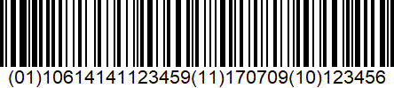
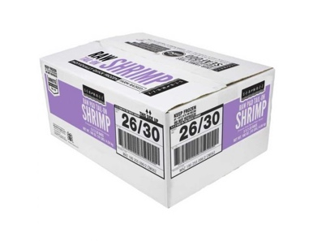

## Critical Tracking Events

A well-defined list of Key Data Elements (KDEs) sets clear
expectations of which data and in what form it needs to be collected
in a supply chain. Well-defined critical tracking events (CTEs) set
clear expectations about who is responsible for creating, sharing, and
adding to data about seafood products as they progress along supply
chains. Well-defined CTEs also ensure that all actors know the moments
when seafood needs to be traceable. The following diagrams of CTEs are
meant to be representative stages of wild-capture and farmed seafood
value chains not a complete picture of every possible stage or
configuration of individual supply chains.

## EPCIS Overview

The decision was made to build on EPCIS as a technical foundation, as
EPCIS is an open GS1 and ISO standard that has emerged as an existing,
well defined and stable enabler for visibility of supply chain events,
with suitable extension mechanisms to integrate seafood needs. EPCIS’
architecture also supports centralized and mixed communication modes,
as requested. Moreover, EPCIS is already applied in parts of the
seafood industry through the GS1 Foundation for Fish, Seafood and
Aquaculture Traceability Guideline.

Note that data ownership and access rights are part of neither the
EPCIS standard nor this guidance and need to be regulated individually
between data exchange parties using EPCIS access functions.

A more general overview, including argumentation supporting the
implementation of EPCIS, can be found in the [EPCIS & CBV
Implementation
Guideline](https://www.gs1.org/docs/epc/EPCIS_Guideline.pdf).

## EPCIS event dimensions

## WHAT

The `What` dimension of an EPCIS event specifies the object observed at the focus of a given business step. In seafood these are typically:

> **GTIN + lot number**: The GTIN + Lot Number (LGTIN) is a
>  class-level GS1 identifier used to identify trade items further
>  qualified by their lot/batch. This is typically used in a GS1-128
>  barcode to identify a case of product and is intended to be scanned
>  in the context of commercial processing and distribution. For
>  example, a case of tuna cans would be identified with a GTIN + Lot
>  and aggregated onto a pallet.

**LGTIN EPC URI**

```
urn:epc:idpat:sgtin:CompanyPrefix.ItemRefAndIndicator.\* {all lots}

urn:epc:class:lgtin:CompanyPrefix.ItemRefAndIndicator.Lot {lot}
``` 

**EPCIS MASTER DATA HEADER EXAMPLE**

```
<EPCISHeader>
 <Extension>
 <EPCISMasterData>
  <VocabularyList> 
   <Vocabulary type="urn:epcglobal:epcis:vtype:EPCClass">
    <VocabularyElementList>
     <VocabularyElement id="urn:epc:idpat:sgtin:0048000.363267.*"> {`*` = applies to all Lots for this GTIN}
      <attribute id="urn:epcglobal:cbv:mda#informationProvider">urn:epc:id:pgln:0048000.000001</attribute>
      <attribute id="urn:epcglobal:cbv:mda#descriptionShort">Yellowfin Tuna</attribute>
      <attribute id="urn:epcglobal:cbv:mda#speciesForFisheryStatisticsPurposesName">Thunnus albacares</attribute> 
      <attribute id="urn:epcglobal:cbv:mda#speciesForFisheryStatisticsPurposesCode">YFT</attribute> 
      <attribute id="urn:epcglobal:cbv:mda#tradeItemConditionCode">WHL</attribute>
     </VocabularyElement>
    </VocabularyElementList>
   </Vocabulary>
  </VocabularyList> 
 </EPCISMasterData>
 </Extension>
</EPCISHeader>
```

**EPCIS BODY EVENT LIST EXAMPLE**:

```
<EPCISBody>
 <EventList>
  <ObjectEvent>
  …
   <quantityList>
    <quantityElement> 
     <epcClass>urn:epc:class:lgtin:0048000.363267.YFT123</epcClass> {A specific Lot for this GTIN}
     <quantity>5714</quantity> 
     <uom>KGM</uom> 
    </quantityElement>
  </quantityList>
…
  </ObjectEvent>
 </EventList>
</EPCISBody>
```

>  **Non-GS1 IDs:** For situations where it is not possible to use a
>    GS1 identifier, there are two options: a URL or a UUID. These can be
>    used to identify any traceable object, document, location or party.
>    The following is an example:

**URL:**

``` 
http://epcis.{company}.com/user/vocab/obj/{identifier}
```

```
<EPCISMasterData>
 <VocabularyElement id=" http://epcis.example.com/user/vocab/obj/363267.YFT123"> {master data element ID}
…
<EPCISBody>
 <EventList>
  <ObjectEvent>
  …
   <quantityList>
    <quantityElement> 
     <epcClass>http://epcis.example.com/user/vocab/obj/363267.YFT123</epcClass> {event element ID, URL}
     <quantity>5714</quantity> 
     <uom>KGM</uom> 
    </quantityElement>
  </quantityList>
…
  </ObjectEvent>
 </EventList>
</EPCISBody>
```

**UUID:**

```
urn:uuid: 2a25ef1c-9b60-4e01-9f87-a19a05a672f8
```

```
<EPCISMasterData>
 <VocabularyElement id="urn:uuid: 2a25ef1c-9b60-4e01-9f87-a19a05a672f8"> {master data element ID}
…
<EPCISBody>
 <EventList>
  <ObjectEvent>
  …
   <quantityList>
    <quantityElement> 
     <epcClass>urn:uuid: 2a25ef1c-9b60-4e01-9f87-a19a05a672f8</epcClass> {event element ID, UUID}
     <quantity>5714</quantity> 
     <uom>KGM</uom> 
    </quantityElement>
  </quantityList>
…
  </ObjectEvent>
 </EventList>
</EPCISBody>
```

## WHEN

The `WHEN` dimension of an EPCIS event is expressed as the eventTime, specifying the precise date, time, and time zone locally in effect at the point in time of an observation and/or at which a given process step is completed.  

The format is of type `xsd:dateTime`, for example: 

```
<EPCISBody>
 <EventList>
  <ObjectEvent>
    <eventTime>2017-08-16T13:26:00.000+02:00</eventTime>
    <eventTimeZoneOffset>+02:00</eventTimeZoneOffset>
```

## WHERE

The `WHERE` dimension of an EPCIS event specifies the read point,
which identifies the location at which an observation and/or process
step took place, as well as the business location, which identifies
the whereabouts of the observed object(s) subsequent to the event in
question.

A seafood EPCIS document should use GLNs expressed as SGLN EPC URIs

(`urn:epc:id:sgln:...`) for location identifiers, unless there are strong
reasons preventing this (as outlined earlier in this document).

In case it is not possible to populate the readPoint and
businessLocation fields with SGLN EPC URIs, a seafood EPCIS document
MAY use:

+ A URL as specified in the CBV;

+ A geographic location URI as specified in \[`RFC5870`\].

By means of geo-fencing, geo-coordinates can be mapped to SGLNs, which
are declared and exchanged in master data shared between trading
partners and other stakeholders.

**Read Point**

The read point is the location at which the observation of object(s)
and/or process step took place. Example of geographic location:

```
<readPoint>
  <id>geo:34.100389,-117.537468</id>
</readPoint>
```

**Business Location**

The business location specifies the whereabouts of the object(s)
immediately subsequent to the event, until this information is
superseded by the business location of a later event.

For objects in transit, the business location is unknown and therefore
omitted.

### Example using GLN:

```
<bizLocation>
  <id>urn:epc:id:sgln:0048000.00003.0</id>
</bizLocation>
```
 
### COMBINED EXAMPLE:

```
<EPCISBody>
<EventList>
<ObjectEvent>
<eventTime>2017-08-16T13:26:00.000+02:00</eventTime>
<eventTimeZoneOffset>+02:00</eventTimeZoneOffset>
...

<readPoint>

<id>geo:34.100389,-117.537468</id> {example using latitude and longitude}

</readPoint>

<bizLocation>

<id>urn:epc:id:sgln:0048000.00003.0</id> {example using GLN}

</bizLocation>
...

```

## WHY

The `WHY` dimension puts the EPCIS event into a specific business
context, specifying the process step associated with the observation
of the object(s), the disposition of the object(s) subsequent to the
event, related business transactions and the source and destination of
the object(s).

**Business Step**

The business step identifies what was taking place from a business
perspective at the time of the event; that is, what step of a business
process was occurring. Examples include `commissioning`,
`creating_class_instance`, `inspecting`, `packing`, `picking`,
`shipping`, `retail_selling.` The GS1 Core Business Vocabulary
(CBV) standard specifies a list of cross-sector, standardized business
step values.

**Disposition**

The disposition identifies the business condition subsequent to the
event of the physical or digital objects named in the WHAT dimension.
Example dispositions include `active`, `in_progress`, `in_transit`, `expired`, `recalled`, `retail_sold` and `stolen.` The
GS1 CBV includes a list of standard Disposition values.

**Business Transactions**

A business transaction list identifies one or more particular business
transactions that are relevant to an event. A business transaction is
identified by a pair of identifiers: one identifier that says what
type of business transaction is referenced, and a second identifier
that names the particular business transaction of that type. Examples
of business transaction types are purchase order (`po`), bill of
lading (`bol`), despatch advice (`desadv`). The GS1 CBV includes a
list of standard business transaction type values.

```
<EPCISBody>
	<EventList>
		<ObjectEvent>
			<eventTime>2017-08-16T13:26:00.000+02:00</eventTime>
			<eventTimeZoneOffset>+02:00</eventTimeZoneOffset>
			<epcList></epcList> {used for serialized identifiers like SSCC or SGTIN}


			<action>OBSERVE</action>
			<bizStep>urn:epcglobal:cbv:bizstep:receiving</bizStep> {receiving event}


			<disposition>urn:epcglobal:cbv:disp:in_transit</disposition>
			<readPoint>
				<id>geo:34.100389,-117.537468</id> {example using latitude and longitude}


			</readPoint>
			<bizLocation>
				<id>urn:epc:id:sgln:0048000.00003.0</id> {example using GLN}


			</bizLocation>
			<bizTransactionList>
				<bizTransaction type="urn:epcglobal:cbv:btt:po">500127042</bizTransaction> {purchase order}


				<bizTransaction type="urn:epcglobal:cbv:btt:inv">9992332</bizTransaction> {invoice}


				<bizTransaction type="urn:epcglobal:cbv:btt:cert">ABC123</bizTransaction> {certificate}


			</bizTransactionList>
			<extension>
				<quantityList>
					<quantityElement>
						<epcClass>urn:epc:class:lgtin:0048000.363267.YFT123</epcClass> {A specific Lot for this GTIN}


						<quantity>5714</quantity>
						<uom>KGM</uom>
					</quantityElement>
				</quantityList>
			</extension>
			<gdst:productOwner>urn:epc:id:pgln:0048000.000001</gdst:productOwner>
			<cbvmda:informationProvider>urn:epc:id:pgln:0048000.00001</cbvmda:informationProvider>
		</ObjectEvent>
	</EventList>
</EPCISBody>

```

### EPCIS event types

 EPCIS offers four different event types to record visibility event
 data: Object event, Aggregation event, Transaction event,
 Transformation event. Each event type is associated with action values
 that further qualify the nature of the event.
 
 **Object Event**
 
 An object event applies to one or more objects participated in the
 event in the same way. This is by far the most common event type.
 
 Object event action values are:
  - ADD if the event marks the beginning of the life of the object(s).
    No other events for the same objects should precede this one. This
    is most often used when the business step is `commissioning`

  - DELETE if the event marks the end of the life of the object(s). No
    other events for the same object(s) should follow this one. This is
    most often used when the business step is an end-of-life

  - OBSERVE in all other cases

 **Aggregation Event**
 
 An aggregation event involves a physical aggregation involving a
 `parent` object and one or more `child` objects. An example of an
 aggregation is a pallet consisting of a number of food cases. Each
 child retains its identity even while aggregated to the parent, and
 the aggregation is reversible (that is, it may be `disaggregated`). In
 this example, the cases may be taken off the pallet.
 
 Aggregation event action values are:

  - ADD if children are added to the aggregation during the event; e.g.,
    when adding cases onto a pallet.

  - DELETE if children are removed from the aggregation during the
    event; e.g., when unpacking cases from a pallet.

  - OBSERVE if the parent and children are `seen` in a state of
    aggregation during the event but no children are added or removed,
    e.g. a pallet is shipped to a customer.

 **Transformation Event**
 
 The EPCIS Transformation Event is used to represent a business process
 step in which one or more objects are fully or partially consumed as
 inputs and one or more objects are produced as outputs. The
 Transformation Event captures the relationship between the inputs and
 the outputs, namely that any of the inputs may have contributed in
 some way to each of the outputs.
 
 In contrast to aggregation, a transformation is irreversible.
 Following the transformation, the inputs that were consumed no longer
 exist, and the outputs are brand-new objects that did not exist prior
 to the transformation. In this way, a transformation event functions
 as the beginning-of-life event for the outputs and as end-of-life for
 the inputs (unless the inputs are not fully consumed).
 
 A common reason for tracking transformations is to give business
 processes an understanding of what inputs are linked to what outputs.
 In seafood, for example, the Transformation event links multiple
 batches of fish from different vessels or fishing trips to a common
 finished product:

  - Inputs:
    
      - Lots of Tuna loins from multiple vessels
    
      - Single Lot of Olive oil
    
      - Single Lot of Empty cans

  - Outputs:
    
      - Single Lot of Canned tuna

**Transaction Event**

The event type TransactionEvent describes the association or
disassociation of physical or digital objects to one or more business
transactions. While other event types have an optional
bizTransactionList field that may be used to provide context for an
event, the TransactionEvent is used to declare in an unequivocal way
that certain objects have been associated or disassociated with one or
more business transactions as part of the event.

<span class="underline">For the purposes of this guidance, we will not
use this event type.</span>

### EPCIS document types

#### EPCIS applies two document types.

In this guidance document, the EPCIS Document is the primary method used for transmission of EPCIS events Master Data (parties, locations, sub-locations and products).</span> The rationale is that by incorporating master data with event data, one file fully describes the pedigree of a product. This is extremely useful, especially in cases where sender and receiver have no prior or future business relationship. An example of this would be seafood sold at auction. For trading partners with established information technology relationships, the EPCIS Master Data Document, the GDSN or other data sharing methods are perfectly acceptable.

  - **EPCIS Document**: An `EPCIS Document` is an XML file comprising
    one or more EPCIS events, optionally also including class-level
    master data (CMD) and party/location master data in the document’s
    EPCIS header.

  - **EPCIS Master Data Document**: An `EPCIS Master Data Document` is
    an XML file comprising only master data and no EPCIS events.

## Critical Tracking Event Examples – Wild Caught Tuna to Canned Tuna

The following is a walk-through of a typical Wild Caught Tuna supply
chain beginning with a vessel, through loin processing to a cannery.
Rather than show generalized usage of the EPCIS event visibility
standard, we have elected to use real scenarios. The EPCIS standard is
very flexible, so it can be used to model many different work-flows.
Therefore, the downstream systems should also be designed in a
flexible way.

> EPCIS Event File:
[link](https://www.dropbox.com/s/43cw4hrqfs0a7it/GuidanceDocExample.xml?dl=0)

<table>
<tbody>
<tr class="odd">
<td><p></p>
<p>Source: <a href="https://www.youtube.com/watch?v=B02S3GOILW4">https://www.youtube.com/watch?v=B02S3GOILW4</a></p></td>
<td><p></p>
<p>Frozen Tuna Loins</p>
<p>500 KG Catch Date</p>
<p>Product of Taiwan <strong>July 09, 2017</strong></p>
<table>
<thead>
<tr class="header">
<th>Seafood Company</th>
<th></th>
</tr>
</thead>
<tbody>
<tr class="odd">
<td>Taipei, Taiwan</td>
<td></td>
</tr>
</tbody>
</table></td>
</tr>
</tbody>
</table>

<table>
<thead>
<tr class="header">
<th><strong>Dimension</strong></th>
<th>V1</th>
<th>V2</th>
<th>V3</th>
<th>V4</th>
</tr>
</thead>
<tbody>
<tr class="odd">
<td><strong>Why</strong></td>
<td><p>ObjectEvent</p>
<p>ADD, Commissioning</p></td>
<td><p>ObjectEvent</p>
<p>OBSERVE, Unloading</p></td>
<td><p>ObjectEvent</p>
<p>OBSERVE, Shipping</p></td>
<td><p>ObjectEvent</p>
<p>OBSERVE, Receiving</p></td>
</tr>
<tr class="even">
<td><strong>Who</strong></td>
<td>Vessel Operator</td>
<td>Vessel Operator</td>
<td>Vessel Operator</td>
<td>Processor</td>
</tr>
<tr class="odd">
<td><strong>What</strong></td>
<td><p>Traceable Object (Tuna)</p>
<p>Quantity, UOM</p></td>
<td><p>Traceable Object (Tuna)</p>
<p>Quantity, UOM</p></td>
<td><p>Traceable Object (Tuna)</p>
<p>Quantity, UOM</p></td>
<td><p>Traceable Object (Tuna)</p>
<p>Quantity, UOM</p></td>
</tr>
<tr class="even">
<td><strong>Where</strong></td>
<td>Catch Area, Vessel ID</td>
<td>Port of Landing</td>
<td><p><strong>Source:</strong> Port</p>
<p><strong>Destination:</strong> Processor</p></td>
<td><p><strong>Source:</strong> Port</p>
<p><strong>Destination:</strong> Processor</p></td>
</tr>
<tr class="odd">
<td><strong>When</strong></td>
<td>Date, Time, Zone</td>
<td>Date, Time, Zone</td>
<td>Date, Time, Zone</td>
<td>Date, Time, Zone</td>
</tr>
<tr class="even">
<td><p><strong>Master Data</strong></p>
<p><strong>Header</strong></p></td>
<td><p>Vessel Operator/Owner</p>
<p>Vessel Identifier</p>
<p>Catch Identifier</p></td>
<td>Port Information</td>
<td></td>
<td><p>Customer Contact Info</p>
<p>Ship To Address</p></td>
</tr>
<tr class="odd">
<td><p><strong>Instance/Lot</strong></p>
<p><strong>Master Data</strong></p></td>
<td><p>Catch Area</p>
<p>Economic Zone</p>
<p>Fishing Gear Type</p>
<p>Production Method</p>
<p>Harvest Start/End</p>
<p>Certification List</p></td>
<td></td>
<td></td>
<td></td>
</tr>
<tr class="even">
<td><strong>Tech Info</strong></td>
<td><p>Product Owner</p>
<p>Information Provider</p>
<p>Geolocation of Event</p></td>
<td><p>Product Owner</p>
<p>Information Provider</p>
<p>Geolocation of Event</p></td>
<td><p>Product Owner</p>
<p>Information Provider</p>
<p>Geolocation of Event</p></td>
<td><p>Product Owner</p>
<p>Information Provider</p>
<p>Geolocation of Event</p></td>
</tr>
</tbody>
</table>

<table>
<thead>
<tr class="header">
<th><strong>Dimension</strong></th>
<th>V5</th>
<th>V6</th>
<th>V7</th>
<th>V8</th>
</tr>
</thead>
<tbody>
<tr class="odd">
<td><strong>Why</strong></td>
<td>TransformationEvent</td>
<td><p>AggregationEvent</p>
<p>ADD, Packing</p></td>
<td><p>ObjectEvent</p>
<p>Shipping</p></td>
<td><p>ObjectEvent</p>
<p>OBSERVE, Receiving</p></td>
</tr>
<tr class="even">
<td><strong>Who</strong></td>
<td>Processor</td>
<td>Processor</td>
<td>Vessel Operator</td>
<td>Processor</td>
</tr>
<tr class="odd">
<td><strong>What</strong></td>
<td><p><strong>Input:</strong> Whole Tuna</p>
<p><strong>Output:</strong> Frozen Loins</p></td>
<td><p><strong>Parent:</strong> Container</p>
<p><strong>Children:</strong></p>
<p>Frozen Tuna Loin Cases</p></td>
<td>Container</td>
<td>Container</td>
</tr>
<tr class="even">
<td><strong>Where</strong></td>
<td>Loin Processing Plant</td>
<td>Loin Processing Plant</td>
<td><p><strong>Source:</strong> Loin Plant</p>
<p><strong>Destination:</strong> Canner</p></td>
<td><p><strong>Source:</strong> Loin Plant</p>
<p><strong>Destination:</strong> Canner</p></td>
</tr>
<tr class="odd">
<td><strong>When</strong></td>
<td>Date, Time, Zone</td>
<td>Date, Time, Zone</td>
<td>Date, Time, Zone</td>
<td>Date, Time, Zone</td>
</tr>
<tr class="even">
<td><p><strong>Master Data</strong></p>
<p><strong>Header</strong></p></td>
<td><p>Plant Operator/Owner</p>
<p>Plant Identifier</p>
<p>Frozen Tuna Loins ID</p></td>
<td></td>
<td><p>Customer Contact Info</p>
<p>Ship To Address</p></td>
<td><p>Customer Contact Info</p>
<p>Ship To Address</p></td>
</tr>
<tr class="odd">
<td><p><strong>Instance/Lot</strong></p>
<p><strong>Master Data</strong></p></td>
<td><p>Lot Number</p>
<p>Production Date</p>
<p>Storage State</p>
<p>First Freeze Date</p></td>
<td></td>
<td></td>
<td></td>
</tr>
<tr class="even">
<td><strong>Tech Info</strong></td>
<td><p>Product Owner</p>
<p>Information Provider</p>
<p>Geolocation of Event</p></td>
<td><p>Product Owner</p>
<p>Information Provider</p>
<p>Geolocation of Event</p></td>
<td><p>Product Owner</p>
<p>Information Provider</p>
<p>Geolocation of Event</p></td>
<td><p>Product Owner</p>
<p>Information Provider</p>
<p>Geolocation of Event</p></td>
</tr>
</tbody>
</table>

<table>
<thead>
<tr class="header">
<th><strong>Dimension</strong></th>
<th>V9</th>
<th>V10</th>
<th>V11</th>
<th>V12</th>
</tr>
</thead>
<tbody>
<tr class="odd">
<td><strong>Why</strong></td>
<td><p>AggregationEvent</p>
<p>DELETE, Unpacking</p></td>
<td><p>TransformationEvent</p>
<p>ADD</p></td>
<td><p>AggregationEvent</p>
<p>ADD, Packing</p></td>
<td><p>ObjectEvent</p>
<p>OBSERVE, Shipping</p></td>
</tr>
<tr class="even">
<td><strong>Who</strong></td>
<td>Processor</td>
<td>Processor</td>
<td>Processor</td>
<td>Processor</td>
</tr>
<tr class="odd">
<td><strong>What</strong></td>
<td><p><strong>Parent:</strong> Container</p>
<p><strong>Children:</strong> {blank}</p></td>
<td><p><strong>Input:</strong> Tuna Loins</p>
<p><strong>Output:</strong> Canned Tuna</p></td>
<td><p><strong>Parent:</strong> Pallet SSCC</p>
<p><strong>Children:</strong></p>
<p>Cases of Canned Tuna</p></td>
<td>Pallet SSCC</td>
</tr>
<tr class="even">
<td><strong>Where</strong></td>
<td>Canning Plant</td>
<td>Canning Plant</td>
<td>Canning Plant</td>
<td><p><strong>Source:</strong> Loin Plant</p>
<p><strong>Destination:</strong> Canner</p></td>
</tr>
<tr class="odd">
<td><strong>When</strong></td>
<td>Date, Time, Zone</td>
<td>Date, Time, Zone</td>
<td>Date, Time, Zone</td>
<td>Date, Time, Zone</td>
</tr>
<tr class="even">
<td><p><strong>Master Data</strong></p>
<p><strong>Header</strong></p></td>
<td></td>
<td><p>Canner Operator/Owner</p>
<p>Canning Plant Identifier</p>
<p>Canned Tuna ID</p></td>
<td></td>
<td><p>Customer Contact Info</p>
<p>Ship To Address</p></td>
</tr>
<tr class="odd">
<td><p><strong>Instance/Lot</strong></p>
<p><strong>Master Data</strong></p></td>
<td></td>
<td><p>Preservation Technique</p>
<p>Best Before Date</p>
<p>MSC Certification</p></td>
<td></td>
<td></td>
</tr>
<tr class="even">
<td><strong>Tech Info</strong></td>
<td><p>Product Owner</p>
<p>Information Provider</p>
<p>Geolocation of Event</p></td>
<td><p>Product Owner</p>
<p>Information Provider</p>
<p>Geolocation of Event</p></td>
<td><p>Product Owner</p>
<p>Information Provider</p>
<p>Geolocation of Event</p></td>
<td><p>Product Owner</p>
<p>Information Provider</p>
<p>Geolocation of Event</p></td>
</tr>
</tbody>
</table>

## Critical Tracking Event Examples – Aquaculture

The following is a walk-through of a typical Aquaculture supply chain
beginning with a farm, through processing to a retailer. Rather than
show generalized usage of the EPCIS event visibility standard, we have
elected to use real scenarios. The EPCIS standard is very flexible, so
it can be used to model many different work-flows. Therefore, the
downstream systems should also be designed in a flexible way.

### EPCIS Event File:

<table>
<tbody>
<tr class="odd">
<td><p></p>
<p>Source: <a href="https://www.foodservicedirect.com/seamazz-26-30-raw-tail-on-white-shrimp-2-pound-5-per-case-1220705.html?gclid=CjwKCAjwxOvsBRAjEiwAuY7L8mjNn58qBHxL2UGqSboXBtoox3WvqSheyC7qey38AyuDkEueyIetCRoCOH4QAvD_BwE">food service direct</a></p></td>
<td><p></p>
<p>26-30 Raw Tail On White Shrimp</p>
<p>2 LB x 5 per Case Harvest Date</p>
<p>Product of Thailand <strong>July 09, 2017</strong></p>
<table>
<thead>
<tr class="header">
<th>Shrimp Farming Company</th>
<th></th>
</tr>
</thead>
<tbody>
<tr class="odd">
<td>Bangkok, Thailand</td>
<td></td>
</tr>
</tbody>
</table></td>
</tr>
</tbody>
</table>

<table>
<thead>
<tr class="header">
<th><strong>Dimension</strong></th>
<th>V1</th>
<th>V2</th>
<th>V3</th>
<th>V4</th>
</tr>
</thead>
<tbody>
<tr class="odd">
<td><strong>Why</strong></td>
<td>TransformationEvent</td>
<td><p>ObjectEvent</p>
<p>ADD, Commissioning</p></td>
<td>TransformationEvent</td>
<td><p>ObjectEvent</p>
<p>OBSERVE, Shipping</p></td>
</tr>
<tr class="even">
<td><strong>Who</strong></td>
<td>Feed Mill</td>
<td>Farmer</td>
<td>Farmer</td>
<td>Farmer</td>
</tr>
<tr class="odd">
<td><strong>What</strong></td>
<td><p>Input: Ingredients</p>
<p>Output: Feed ID</p></td>
<td>Broodstock ID</td>
<td><p><strong>Input:</strong></p>
<p>Feed ID, Broodstock ID</p>
<p><strong>Output:</strong></p>
<p>Live Shrimp ID</p></td>
<td>Live Shrimp ID</td>
</tr>
<tr class="even">
<td><strong>Where</strong></td>
<td>Feedmill</td>
<td>Hatchery</td>
<td>Farm</td>
<td><p><strong>Source:</strong> Farm</p>
<p><strong>Destination:</strong> Processor</p></td>
</tr>
<tr class="odd">
<td><strong>When</strong></td>
<td>Date, Time, Zone</td>
<td>Date, Time, Zone</td>
<td>Date, Time, Zone</td>
<td>Date, Time, Zone</td>
</tr>
<tr class="even">
<td><p><strong>Master Data</strong></p>
<p><strong>Header</strong></p></td>
<td><p>Mill Owner</p>
<p>Mill Identifier</p>
<p>Feed Identifier</p></td>
<td><p>Hatchery Owner</p>
<p>Hatchery Identifier</p>
<p>Broodstock Identifier</p></td>
<td><p>Farm Owner</p>
<p>Farm Identifier</p>
<p>Live Shrimp Identifier</p></td>
<td>Processor ID and Address</td>
</tr>
<tr class="odd">
<td><p><strong>Instance/Lot</strong></p>
<p><strong>Master Data</strong></p></td>
<td><p>Source of Protein</p>
<p>Feed Type</p>
<p>Certification List</p></td>
<td><p>Harvest Start/End Date</p>
<p>Source of Broodstock</p></td>
<td><p>Farming Method</p>
<p>Date of Harvest</p></td>
<td></td>
</tr>
<tr class="even">
<td><strong>Tech Info</strong></td>
<td><p>Product Owner</p>
<p>Information Provider</p>
<p>Geolocation of Event</p></td>
<td><p>Product Owner</p>
<p>Information Provider</p>
<p>Geolocation of Event</p></td>
<td><p>Product Owner</p>
<p>Information Provider</p>
<p>Geolocation of Event</p></td>
<td><p>Product Owner</p>
<p>Information Provider</p>
<p>Geolocation of Event</p></td>
</tr>
</tbody>
</table>

<table>
<thead>
<tr class="header">
<th><strong>Dimension</strong></th>
<th>V5</th>
<th>V6</th>
<th>V7</th>
<th>V8</th>
</tr>
</thead>
<tbody>
<tr class="odd">
<td><strong>Why</strong></td>
<td>TransformationEvent</td>
<td><p>AggregationEvent</p>
<p>ADD, Packing</p></td>
<td><p>ObjectEvent</p>
<p>OBSERVE, Shipping</p></td>
<td><p>ObjectEvent</p>
<p>OBSERVE, Receiving</p></td>
</tr>
<tr class="even">
<td><strong>Who</strong></td>
<td>Processor</td>
<td>Processor</td>
<td>Processor</td>
<td>Retailer</td>
</tr>
<tr class="odd">
<td><strong>What</strong></td>
<td><p><strong>Input:</strong> Live Shrimp ID</p>
<p><strong>Output:</strong> Frozen Shrimp</p></td>
<td><p><strong>Parent:</strong> Pallet</p>
<p><strong>Children:</strong></p>
<p>Frozen Shrimp Cases</p></td>
<td>Pallet</td>
<td>Pallet</td>
</tr>
<tr class="even">
<td><strong>Where</strong></td>
<td>Shrimp Processing Plant</td>
<td>Shrimp Processing Plant</td>
<td><p><strong>Source:</strong> Shrimp Plant</p>
<p><strong>Destination:</strong> Retailer DC</p></td>
<td><p><strong>Source:</strong> Shrimp Plant</p>
<p><strong>Destination:</strong> Retailer</p></td>
</tr>
<tr class="odd">
<td><strong>When</strong></td>
<td>Date, Time, Zone</td>
<td>Date, Time, Zone</td>
<td>Date, Time, Zone</td>
<td>Date, Time, Zone</td>
</tr>
<tr class="even">
<td><p><strong>Master Data</strong></p>
<p><strong>Header</strong></p></td>
<td><p>Plant Operator/Owner</p>
<p>Plant Identifier</p>
<p>Frozen Shrimp ID</p></td>
<td></td>
<td></td>
<td><p>Retail Legal Entity</p>
<p>Retail DC ID and Address</p></td>
</tr>
<tr class="odd">
<td><p><strong>Instance/Lot</strong></p>
<p><strong>Master Data</strong></p></td>
<td><p>Product Form</p>
<p>Production Date</p>
<p>Product Country of Origin</p></td>
<td></td>
<td></td>
<td></td>
</tr>
<tr class="even">
<td><strong>Tech Info</strong></td>
<td><p>Product Owner</p>
<p>Information Provider</p>
<p>Geolocation of Event</p></td>
<td><p>Product Owner</p>
<p>Information Provider</p>
<p>Geolocation of Event</p></td>
<td><p>Product Owner</p>
<p>Information Provider</p>
<p>Geolocation of Event</p></td>
<td><p>Product Owner</p>
<p>Information Provider</p>
<p>Geolocation of Event</p></td>
</tr>
</tbody>
</table>