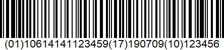

Traceability is a multi-party, multi-chain challenge. Therefore,
alignment and collaboration with supply chain partners is essential.
This is where standards come into play. Open supply chain standards
enable interoperability between all parties by establishing a common
set of rules for identification, data capture, data sharing and data
usage. 

> **Note**: Point of Sale identifiers are excluded from this
> guidance. Those are covered in detail by other Seafood Traceability
> Guidance documents from GS1 and trading partners and are not directly
> tied to supply chain traceability and interoperability. The object,
> entity and location identifiers in this section are a combination of
> GS1 standards and non-GS1 methods. The identifiers outlined for the
> GDST framework are Universal Unique Identification (UUID), URLs, and
> GS1 GTIN and Lot (LGTIN). The former two are physically represented by
> QR codes while GS1 identification uses barcodes (i.e. GS1-128, SSCC).
> The tables in 6.1 show the recommended optically read identifiers, but
> may also use RFIDs or IoT devices as long as they are representing
> objects with a UUID, URL or GS1 identifier.

## Traceable Object, Entity and Location Identifiers

A traceable object is a physical or digital object whose supply chain path can and needs to be determined.

### On the Vessel or Farm

The following are example identifiers for wild caught and farmed fish, location identifiers for vessels and farms.

<table>
<thead>
<tr class="header">
<th><strong>Role</strong></th>
<th><strong>Object, Entity, Location</strong></th>
<th><strong>Usage and Example</strong></th>
</tr>
</thead>
<tbody>
<tr class="odd">
<td>
<strong>Fisherman</strong>

<strong>Or Farmer</strong>
</td>
<td>
<strong>Fresh Caught or Harvest Seafood</strong>

<a href="https://en.wikipedia.org/wiki/URL">URL</a>

<a href="https://en.wikipedia.org/wiki/Universally_unique_identifier">UUID</a>

<a href="https://www.gs1.org/sites/default/files/docs/barcodes/GS1_General_Specifications.pdf#page=148">GS1 GTIN</a>+Lot
</td>
<td>
Identify catch or harvest with a either a globally unique GS1 GTIN and Lot (LGTIN) based on either a <a href="https://www.gs1.org/sites/default/files/docs/barcodes/GS1_General_Specifications.pdf#page=20">GS1 Company Prefix</a> or a purchased individual GS1 GTIN. If a GS1 Prefix is not available, one may substitute a web URL, or UUID since they are also globally unique. A GS1 GTIN and Lot, along with catch or harvest date are incorporated into a <a href="https://www.gs1.org/sites/default/files/docs/barcodes/GS1_General_Specifications.pdf#page=271">GS1-128 Barcode</a>. A URL or UUID are incorporated into a <a href="https://www.qr-code-generator.com/">QR Code</a>. The barcode is applied to a container or is displayed on a mobile device to enable data transfer. Example IDs:

http://epcis.example.com/user/vocab/obj/123456 <em>or</em>

urn:uuid:a2222482-7f96-4d6d-9431-c4e6e3ef4888

urn:epc:class:lgtin:0614141.112345.123456

Online Barcode Generator used for examples below: <a href="https://barcode.tec-it.com/en">https://barcode.tec-it.com/en</a>
</td>
</tr>
<tr class="even">
<td>

<strong>http://epcis.example.com/user/vocab/obj/123456</strong>
</td>
<td>

<strong>urn:uuid:a2222482-7f96-4d6d-9431-c4e6e3ef4888</strong>
</td>
<td>

<a href="https://www.gs1.org/standards/barcodes/1d-general-distribution">GS1-128 Barcode</a>

(01) <a href="https://www.gs1.org/standards/barcodes/application-identifiers/01?lang=en">Product GTIN</a>

(11) <a href="https://www.gs1.org/standards/barcodes/application-identifiers/11?lang=en">Catch/Harvest Date</a>

(10) <a href="https://www.gs1.org/standards/barcodes/application-identifiers/10?lang=en">Batch or Lot</a>

<strong>urn:epc:class:lgtin:0614141.112345.123456</strong>
</td>
</tr>
<tr class="odd">
<td><strong>Fisherman or Farmer</strong></td>
<td>
<strong>Party</strong>

URL

UUID

<a href="https://www.gs1.org/sites/default/files/docs/barcodes/GS1_General_Specifications.pdf#page=172">GS1 PGLN</a>
</td>
<td>
Identify farm or vessel legal owner - also known as a `party`. This can either be purchased from a local GS1 member organization or assigned by a licensed agency such as GLOBALG.A.P. In the case where this is not available, one can apply the same method as for traceable objects above and generate a URL or UUID.

http://epcis.example.com/user/vocab/party/00300 <em>or</em>

urn:uuid:7af5bcbe-df79-412d-8603-e536b219bb28

urn:epc:id:pgln: 0614141.00300.0
</td>
</tr>
<tr class="even">
<td>

<strong>http://epcis.example.com/user/vocab/party/440</strong>
</td>
<td>

<strong>urn:uuid:7af5bcbe-df79-412d-8603-e536b219bb28</strong>
</td>
<td>

<a href="https://www.gs1.org/standards/barcodes/1d-general-distribution">GS1-128 Barcode</a>

(417) Party GLN

<strong>urn:epc:id:pgln:0614141.00440.0</strong>
</td>
</tr>
<tr class="odd">
<td>
<strong>Fisherman or</strong>

<strong>Farmer</strong>
</td>
<td>
<strong>Location</strong>

URL

UUID

<a href="https://www.gs1.org/sites/default/files/docs/barcodes/GS1_General_Specifications.pdf#page=171">GS1 SGLN</a>
</td>
<td>
Identify vessels, farms and other related facilities or locations. Note that the Party GLN is 0614141.00300.0 and the subordinate vessels and farms are built from the Party GLN using the <a href="https://www.gs1.org/1/glnrules/en/rule/175">GLN extension</a>. The ramification of this design is that the farmer or fisherman need only purchase one Party GLN if they do not have a GS1 Company Prefix.

http://epcis.example.com/user/vocab/loc/123456 <em>or</em>

urn:uuid:4e81c664-77b1-412f-ba59-b92aaf5244eb

urn:epc:id:sgln:0614141.00300.123456
</td>
</tr>
<tr class="even">
<td>

<strong>http://epcis.example.com/user/vocab/loc/789123</strong>
</td>
<td>

<strong>urn:uuid:4e81c664-77b1-412f-ba59-b92aaf5244eb</strong>
</td>
<td>

<a href="https://www.gs1.org/standards/barcodes/1d-general-distribution">GS1-128 Barcode</a>

(414) <a href="https://www.gs1.org/standards/barcodes/application-identifiers/414?lang=en">Physical Location GLN</a>

(254) <a href="https://www.gs1.org/standards/barcodes/application-identifiers/254?lang=en">GLN Extension</a>

<strong>urn:epc:id:sgln:0614141.00300.123456</strong>
</td>
</tr>
</tbody>
</table>

### At a Processor or Consumer Packaged Goods Company (CPG)

The following are example identifiers for both intermediate and
finished goods processors who ship product to trading partners. We
strongly recommend using GS1 Identifiers at this stage as they may be
received and handled by organizations with systems based on GS1
Standards. In the event this is not feasible, one may use the URL or
URN identifiers shown above. However, this will require communication
between trading partners to assure compatibility.

<table>
<thead>
<tr class="header">
<th><strong>Role</strong></th>
<th><strong>Object, Entity, Location</strong></th>
<th><strong>Usage and Example</strong></th>
</tr>
</thead>
<tbody>
<tr class="odd">
<td><strong>Processor &amp; CPG</strong></td>
<td><a href="https://www.gs1us.org/DesktopModules/Bring2mind/DMX/Download.aspx?Command=Core_Download&amp;EntryId=559&amp;language=en-US&amp;PortalId=0&amp;TabId=134#page=18"><strong>Processed SeafoodCase Label</strong></a></td>
<td>
Identify processed seafood with a globally unique GS1 GTIN and Lot (LGTIN) based on a <a href="https://www.gs1.org/sites/default/files/docs/barcodes/GS1_General_Specifications.pdf#page=20">GS1 Company Prefix</a>. The LGTIN, along with either <a href="https://www.gs1.org/standards/barcodes/application-identifiers/13?lang=en">Packaging Date</a>, <a href="https://www.gs1.org/standards/barcodes/application-identifiers/15?lang=en">Best Before Date</a>, <a href="https://www.gs1.org/standards/barcodes/application-identifiers/16?lang=en">Sell by Date</a>, <a href="https://www.gs1.org/standards/barcodes/application-identifiers/17?lang=en">Expiration Date</a> should be incorporated into a <a href="https://www.gs1.org/sites/default/files/docs/barcodes/GS1_General_Specifications.pdf#page=271">GS1-128 Barcode</a>. The barcode label is applied to a container intended for general distribution and logistics (case, carton, plastic bin, etc). Example ID:

urn:epc:class:lgtin:0614141.112345.123456

Online Barcode Generator used for examples below: <a href="https://barcode.tec-it.com/en">https://barcode.tec-it.com/en</a>
</td>
</tr>
<tr class="even">
<td>

<strong>Human Readable Text on General Distribution Case Label</strong>

<ul>
<li><blockquote>

Brand Owner/Company Name

</blockquote></li>
<li><blockquote>

Product description

</blockquote></li>
<li><blockquote>

Lot number

</blockquote></li>
<li><blockquote>

Global Trade Item Number (GTIN)

</blockquote></li>
<li><blockquote>

Catch date, Best before date

</blockquote></li>
<li><blockquote>

Sell-by date, Use-by date or

</blockquote></li>
<li><blockquote>

Production date

</blockquote></li>
<li><blockquote>

Net Weight and Serial Number for Variable Weight Cases

</blockquote></li>
</ul></td>

</tr>
<tr class="odd">
<td><blockquote>

<strong>Barcode Encoded Information on General Distribution Case Label</strong>

</blockquote>
<ul>
<li><blockquote>

Global Trade Item Number (GTIN)

</blockquote></li>
<li><blockquote>

Lot Number

</blockquote></li>
<li><blockquote>

Date: Catch, Best before, Sell-by, Use-by or Production

</blockquote></li>
<li><blockquote>

Net Weight and Serial Number for Variable Weight Cases

</blockquote></li>
</ul>

</td>
<td></td>
<td></td>
</tr>
<tr class="even">
<td><strong>Processor &amp; CPG</strong></td>
<td><a href="https://www.gs1.org/sites/default/files/docs/barcodes/GS1_General_Specifications.pdf#page=148"><strong>LogisticsUnit(SSCC)</strong></a></td>
<td>
Identify a pallet containing processed seafood cases with a globally unique Serial Shipping Container Code based on a <a href="https://www.gs1.org/sites/default/files/docs/barcodes/GS1_General_Specifications.pdf#page=20">GS1 Company Prefix</a>. The SSCC should be incorporated into a <a href="https://www.gs1.org/sites/default/files/docs/barcodes/GS1_General_Specifications.pdf#page=271">GS1-128 Barcode</a>. The barcode label is applied to a pallet intended for general distribution and logistics. Example ID:

urn:epc:id:sscc:0614141.0000392090

Online Barcode Generator used for examples below: <a href="https://barcode.tec-it.com/en">https://barcode.tec-it.com/en</a>
</td>
</tr>
<tr class="odd">
<td><blockquote>

<strong>Optional Human Readable Text on Pallet Label</strong>

</blockquote>
<ul>
<li><blockquote>

Global Trade Item Number (GTIN)

</blockquote></li>
<li><blockquote>

Count

</blockquote></li>
<li><blockquote>

Batch/Lot

</blockquote></li>
<li><blockquote>

Catch, Best before, Sell-by, Use-by or Production date

</blockquote></li>
</ul></td>
<td></td>
<td></td>
</tr>
<tr class="even">
<td>
<strong>Required Barcode Encoded and Human Readable Information on Pallet Label</strong>

<ul>
<li>
Serial Shipping Container Code (SSCC)
</li>
</ul>

</td>
<td></td>
<td></td>
</tr>
<tr class="odd">
<td><strong>Processor &amp; CPG</strong></td>
<td>
<strong>Party</strong>

<a href="https://www.gs1.org/sites/default/files/docs/barcodes/GS1_General_Specifications.pdf#page=172">GS1 Party GLN</a>
</td>
<td>
Identify Processor legal owner - also known as a `party`. This can be purchased from a local <a href="https://www.gs1.org/contact/overview">GS1 member organization</a>. It is strongly encouraged that a GLN is used rather than a URL or UUID because a PGLN can be used to convey ownership in a globally unique way across the supply chain. This is particularly helpful for chain of custody and other IUU data quality assurance needs. Understandably, it may be the case that the vessel owner or operator may not have a GS1 identifier, so the processor may be the first link in the supply chain to collect and share traceability events.

urn:epc:id:pgln: 0614141.00300.0
</td>
</tr>
<tr class="even">
<td>

<a href="https://www.gs1.org/standards/barcodes/1d-general-distribution">GS1-128 Barcode</a>

(417) Party GLN

<strong>urn:epc:id:pgln:0614141.00440.0</strong>
</td>
<td></td>
<td></td>
</tr>
<tr class="odd">
<td><strong>Processor &amp; CPG</strong></td>
<td>
<strong>Location</strong>

<a href="https://www.gs1.org/sites/default/files/docs/barcodes/GS1_General_Specifications.pdf#page=171">GS1 Physical Location GLN</a>
</td>
<td>Identify manufacturing facilities or other locations. Note that the Party GLN is 0614141.00<strong>300</strong>.0. The first physical location is indicated by incrementing to the next GLN, 0614141.00<strong>301</strong>.0 In the vessel or farm example, we used the GLN extension due to cost considerations. In the case of an operator with a GS1 Company Prefix (GCP), this method is not needed because there is no incremental cost for generating GLNs. A company may assign many GLNs based on a single GCP. This simplifies location identification and data sharing with trading partners. urn:epc:id:sgln:0614141.00301.0</td>
</tr>
<tr class="even">
<td>

<a href="https://www.gs1.org/standards/barcodes/1d-general-distribution">GS1-128 Barcode</a>

(414) <a href="https://www.gs1.org/standards/barcodes/application-identifiers/414?lang=en">Physical Location GLN</a>

<strong>urn:epc:id:sgln:0614141.00301.0</strong>
</td>
<td></td>
<td></td>
</tr>
</tbody>
</table>

## Automated data capture

> Once objects, parties and locations are uniquely identified and
> machine readable, capturing critical tracking events becomes simpler
> and more accurate. From consumer grade mobile devices to high speed
> industrial scanners, a quick scan and database lookup provides the
> user with pre-filled information that speeds event capture.

## Sharing traceability data

> The collection of traceability data from other parties and the
> provision of data to other parties are essential components in
> distributed traceability systems. The five traceability choreographies
> (see section 3.3.5) all pose different requirements when it comes to
> the standards-based exchange of data.

### Separation of content and communication method

> An important principle is the separation of data content from the way
> the data is exchanged (the communication method).
> 
> In terms of data content this guidance document pertains to three
> categories of business data that are shared between end users:
> 
> ■ Master data that provide descriptive attributes of real-world
> entities identified by identification keys, including trade items,
> parties, and physical locations.
> 
> ■ Transaction data that consist of trade transactions, triggering or
> confirming the execution of a function within a business process as
> defined by an explicit business agreement (e.g., a supply contract) or
> an implicit one (e.g., customs processing), from the start of the
> business process (e.g., ordering the product) to the end of it (e.g.,
> final settlement), also making use of identification keys.
> 
> ■ Visibility event data provide details about activity in the supply
> chain of products and other physical or digital assets, identified by
> keys, detailing where these objects are in time, and why; not just
> within one company’s four walls, but throughout the supply chain. It
> makes it possible to track and trace goods with live data along the
> process.
> 
> The communication methods applied in the GS1 standards may be broadly
> classified in two groups:
> 
> ■ Push methods, where one party unilaterally transfers data to another
> in the absence of a prior request. Push methods may be further
> classified as:

  - Bilateral party-to-party push, where one party transfers data
    directly to another party.

  - Publish/subscribe, where one party transfers data to a data pool or
    repository, which in turn pushes the data to other parties who have
    previously expressed interest in that data by registering a
    subscription (`selective push`).

  - Broadcast, where a party publishes business data in a well-known or
    publicly-accessible place such as a World Wide Web page, where it
    may be retrieved by any interested party. Broadcast does not
    necessarily mean that the data is available to anyone; the data may
    be encrypted for a specific intended user or the broadcast channel
    (e.g. website) may require the receiving party to authenticate and
    may only grant access to the broadcast data according to specific
    access control policies.

> ■ Pull or query methods, where one party makes a request for specific
> data to another party, who in turn responds with the desired data.
> Note that in the above classification of Push methods, the Broadcast
> method may also involve a Pull query, in order to retrieve the data
> from a publicly- accessible place (such as a website).

## Data sharing standards and services

> Commercial software solution providers and GS1 offer a number of
> services, based on the types of data and communication methods
> described above. All GS1 data exchange standards and services are
> based on the use of GS1 identification keys, rather than relying on
> internal identifiers or descriptive elements. The use of globally
> unique keys greatly simplifies implementations between trading
> partners, since they provide interoperability across the various
> systems.
> 
> Commercial software providers offer GS1 and non-GS1 based solutions
> for data sharing.
> 
> The following is an overview of the GS1 data sharing standards and
> utilities:

<table>
<thead>
<tr class="header">
<th><strong>Standard</strong></th>
<th><strong>Description</strong></th>
<th><strong>Communication Method</strong></th>
</tr>
</thead>
<tbody>
<tr class="odd">
<td><strong>Master Data</strong></td>
<td></td>
<td></td>
</tr>
<tr class="even">
<td>GS1 Global Data Synchronization Network® (GDSN)</td>
<td>The GS1 Global Data Synchronization Network® (GDSN) enables trading partners to automatically share their business data with each other. This means organizations can have confidence that when one of their suppliers updates their database, their own database is similarly updated as a result. Everyone has access to the same continuously refreshed data.</td>
<td>Publish / subscribe</td>
</tr>
<tr class="odd">
<td>GS1 Source</td>
<td>GS1 Source is a network of data aggregators who have all agreed to use GS1 standards. Data aggregators gather product data from brand owners and manufacturers, share it with each other on the cloud, and make it available to developers for their web and mobile applications.</td>
<td>Pull</td>
</tr>
<tr class="even">
<td>GS1 SmartSearch</td>
<td>GS1 SmartSearch standard makes it possible to create structured data about objects and relate this data to its GS1 identification key. The structured data about the object (e.g. a product) can then be used by search engines, smartphone apps, etc. to deliver a richer experience to the user.</td>
<td>Broadcast</td>
</tr>
<tr class="odd">
<td>GLN Service</td>
<td>The GS1 GLN Service provides a single point of access to GS1 GLN master data via an interconnected network of local registries.</td>
<td>Pull</td>
</tr>
<tr class="even">
<td>GS1 EDI</td>
<td>GS1 EDI provides some messages in support of bilateral master data exchange, in particular the EANCOM PRICAT, PRODAT &amp; PARTIN messages and GS1 XML Item data notification.</td>
<td>Bilateral push</td>
</tr>
<tr class="odd">
<td>EPCIS</td>
<td>There are several ways to transmit master data via EPCIS: (1) Master data query (2) Instance/Lot Master Data (ILMD), (3) Header of EPCIS document (4) EPCIS master data document. See [EPCIS] for more information.</td>
<td>Pull (to support on- demand synchronous queries) as well as Push (publish/subscribe to standing query notifications).</td>
</tr>
<tr class="even">
<td><strong>Transactional data</strong></td>
<td></td>
<td></td>
</tr>
<tr class="odd">
<td>GS1 EDI</td>
<td>GS1 EDI provides trading partners with an efficient business tool for the automatic transmission of commercial data from one computer application directly to another. In EDI, all paper business documents sent previously between companies have been replaced by messages, suitable for exchange by electronic means between computer applications.</td>
<td>Bilateral push</td>
</tr>
<tr class="even">
<td><strong>Visibility event data</strong></td>
<td></td>
<td></td>
</tr>
<tr class="odd">
<td>EPC Information Services (EPCIS) and Core Business Vocabulary (CBV)</td>
<td>
The GS1 EPCIS standard enables disparate applications to create and share visibility event data, both within and across enterprises.

The GS1 CBV standard specifies the structure of vocabularies and specific values for the vocabulary elements to be used in conjunction with the GS1 EPCIS standard.
</td>
<td>Pull (to support on- demand synchronous queries) as well as Push (publish/subscribe to standing query notifications).</td>
</tr>
</tbody>
</table>

## Data discovery, trust and access control

The traceability choreographies mentioned in section 3.3.5 all apply
to the three types of data content. However, each choreography applies
a different mix of communication methods, as illustrated in the table
below.

<table>
<thead>
<tr class="header">
<th><strong>Traceability choreography</strong></th>
<th><strong>Publishing / Contributing</strong></th>
<th><strong>On-demand selective query (synchronous)</strong></th>
<th><strong>Selective standing query (asynchronous)</strong></th>
</tr>
</thead>
<tbody>
<tr class="odd">
<td>
One step up

One step down
</td>
<td>
Push data to relevant trading partner

Example: bilateral EDI or EPCIS messages
</td>
<td>
Pull

(request, response)
</td>
<td>
Publish &amp; subscribe

(receive pushed notifications matching previous standing query subscription)
</td>
</tr>
<tr class="even">
<td>Centralized</td>
<td>
Push data to centralized repository via API, file upload, mobile device or web browser data entry.

Examples: most commercial traceability applications operated by a supply chain owner (IBM Food Trust, Trace Register, FoodLogiQ, fTrace, Origin Trail, VeChain, TE-Food,Fishcoin, etc.)
</td>
<td>
Pull via API

(request, response)
</td>
<td>n/a</td>
</tr>
<tr class="odd">
<td>Discovery of networked resources</td>
<td>
Push referral link to a discovery service

Example: GS1 Digital Link, GS1 GDSN
</td>
<td>
Pull

(request, response)
</td>
<td>n/a</td>
</tr>
<tr class="even">
<td>Networked</td>
<td>
Push data to own repository

Example: distributed EPCIS repositories
</td>
<td>
Pull

(request, response)
</td>
<td>
Publish &amp; subscribe

(receive pushed notifications matching previous standing query subscription)
</td>
</tr>
<tr class="odd">
<td>
Cumulative

(Recommended)
</td>
<td>
Push cumulative data to next 1-down party or between centralized databases.

Example: <a href="https://www.gs1.org/sites/default/files/docs/epc/pedigree_1_0-standard-20070105.pdf">GS1 Pedigree Standard</a>
</td>
<td>
N/A

(downstream parties automatically receive all relevant upstream data; no need to support selective queries)
</td>
<td></td>
</tr>
<tr class="even">
<td>Decentralized and Replicated</td>
<td>
Push and pull data to/from one node for validation then inclusion and replication in decentralized repository or ledger. This enables applications to build off each other because some or all of the data is exposed on a Blockchain.

<strong>Example: Public Blockchain.</strong> The following is an example of seafood traceability sharing on a public Blockchain (Ethereum). This is not an endorsement, simply an <a href="https://www.atato.com/blockchain-food-traceability/">example</a>.
</td>
<td></td>
<td></td>
</tr>
</tbody>
</table>

## Access control

All of the choreographies are in principle capable of selectively
restricting access to the meaning of the exchanged data on a
need-to-know basis, although they differ in the mechanisms used and in
the ability to control whether a receiving party shares the data with
additional parties:

> ■ Some of the choreographies involve bilateral communication between
> an information requesting party (querying party) and an information
> providing party, which may be the original contributor of the data or
> a shared repository holding the data. Privacy of such bilateral
> communications can be assured via mutual authentication, use of secure
> communication channels and potential encryption of the data payload or
> messages.

> ■ Decentralized and replicated choreographies can involve a different
> approach to selectively restricting access to the meaning of the data.
> In the case of a blockchain ledger, trust in the ledger is assured if
> everyone is able to independently inspect the
> entire ledger including all of its data, in order to be assured that
> no historic transaction data has been subsequently altered.
> Although this openness necessarily means that anyone can read all the
> data in the ledger, it is still possible to hide the meaning of
> sensitive data either by encrypting such data or by storing a hash
> value in the ledger. If hash values are stored in a blockchain ledger,
> the original data is typically stored elsewhere and exchanged by
> another mechanism, while the hash value recorded in the blockchain
> ledger effectively archives a ‘tamper-evident seal’ that corresponds
> to what the data originally looked like.

> **_Both security approaches compromise the first principle of the technology_**
> – that everyone can independently
> inspect all of the data in the ledger to assure completeness and
> accuracy. Until this fundamental issue is resolved, decentralized and
> replicated technologies will not provide a demonstrably better tool
> for traceability.

## Event data from devices & sensors and the Internet of Things (IoT)

The enormous growth of sensors and actuators in physical devices, and
the fact that these devices are increasingly connected to the internet
(the Internet of Things) leads to a new category of timestamped event
data that is much broader than the visibility event data currently
handled by the GS1 ALE (Application Level Events) and EPCIS standards.

Sensors passively record changes in the state of the physical world
and the objects contained within it, such as a food temperature sensor
in a truck recording events outside an acceptable temperature range.
Event data from actuators record a history of intentional changes,
such as the opening of a valve for a water reservoir or gas pipeline
or the locking/unlocking of a door.

GS1 has started to engage in IoT-related standardization initiatives,
in particular when it comes to the use of identifiers, the
interpretation (semantics) and fusion (adding business context) of
event data from devices and sensors.

Event data from devices and sensors are expected to be very similar in
nature to visibility event data. The data will be enriched with
business context —including the five dimensions that define the who,
what, when, where and why— and shared using networked or decentralized
choreographies.

## Traceability Solution Ecosystem

Various vendors offer plug-and-play solutions to address the
traceability needs of organizations. Such solutions can be used by
larger organizations to easily on-board numerous suppliers.

Transparency solutions tend to provide supply chain mapping
capabilities, enabling the identification of connections between
suppliers and customers by product type. These solutions often lack
the ability to track or trace an individual object (with a globally
unique identifier) along a specific supply chain path, and their focus
may instead be more on being able to say whether all upstream
suppliers hold specific certifications or accreditations for organic /
environmentally-friendly / ethical practices. Traceability solutions
offer detailed levels of traceability, and often include event-based
data repositories and the ability to logically link related events.

If vendor solutions apply a proprietary data model and closed
ecosystem they are unlikely to be interoperable with competing
solutions. Furthermore, interoperability with existing IT systems of
the users may be limited. Applications that have certified compliance
with GDST Seafood Traceability Interoperability Guidance are much more
likely to support a high level of interoperability for the exchange of
traceability data.